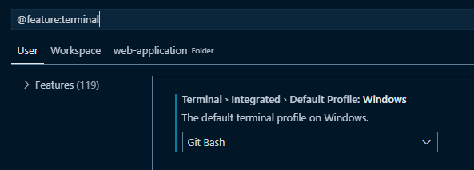

# Visual Studio Code

## Setup

- Global install `npm-check-updates`

```
npm i -g npm-check-updates
```

- Make sure you are using `node` version 22 or higher (LTS) in order for `react-router-dom` to work correctly.

### package.json

To get a list of browsers supported by this app, run `npx browserslist`

### Current browsers supported

| Browsers             | Version                                                       |
| -------------------- | ------------------------------------------------------------- |
| Chrome (Android)     | 133                                                           |
| Firefox (Android)    | 135                                                           |
| QQ Browser (Android) | 14.9                                                          |
| UC Browser (Android) | 15.5                                                          |
| Android WebView      | 133                                                           |
| Chrome               | 133, 132, 131, 126, 125, 109                                  |
| Edge                 | 133, 132                                                      |
| Firefox              | 135, 134, 115                                                 |
| Safari (iOS)         | 18.3, 18.2, 18.1, 18.0, 17.6–17.7, 17.5, 16.6–16.7, 15.6–15.8 |
| Opera Mobile         | 80                                                            |
| Safari (macOS)       | 18.3, 18.1, 17.6, 16.6                                        |
| Samsung Internet     | 27                                                            |

## VSCode

- There are workspace settings that setup other behaviors.
- Add these (typical) settings to the vscode user settings

```json
{
  "codesnap-plus.containerPadding": "1em",
  "codesnap-plus.realLineNumbers": true,
  "codesnap-plus.showWindowControls": false,
  "codesnap-plus.showWindowTitle": true,
  "codesnap-plus.shutterAction": "copy",
  "tabsColor.activeTab": {
    "backgroundColor": "default",
    "fontColor": "default"
  },
  "tabsColor.byDirectory": {
    "\\source\\repos\\": {
      "backgroundColor": "#00FFEE",
      "fontColor": "#9900FF"
    },
    "\\application-container\\": {
      "backgroundColor": "yellow",
      "fontColor": "magenta"
    },
    "\\common-components\\": {
      "backgroundColor": "orange",
      "fontColor": "black"
    },
    "\\identity-server-ui\\": {
      "backgroundColor": "magenta",
      "fontColor": "black"
    },
    "\\modules\\": {
      "backgroundColor": "green",
      "fontColor": "yellow"
    },
    "\\offline-ui\\": {
      "backgroundColor": "#A52A2A",
      "fontColor": "#00FF00"
    }
  },
  "workbench.sideBar.location": "right",
  "workbench.colorTheme": "Night Owl",
  "workbench.iconTheme": "vscode-icons",
  "terminal.integrated.defaultProfile.windows": "Git Bash"
}
```

- If you don't like the default `Powershell` terminal, you can swith to `Git Bash` by selecting `Configure Terminal Settings` and changing:
  
- This relies on a user setting:

```json
"terminal.integrated.defaultProfile.windows": "Git Bash"
```

#### FindItFaster extension

- If you decide to install this, you will need to run `winget` and install the following packages first

```
winget install fzf
winget install Warp.Warp
winget install bat
```

- and you might want to add this to your `settings.json` file:

```
"find-it-faster.general.useTerminalInEditor": true,
```

### Recommended User Settings

### Folder Structure

**NOTE**: This structure is not correct and needs corrected

```
src/
│
├── assets/
│   ├── fonts
│   ├── images
│
├── components/
│   ├── Questions/
│   │   ├── index.ts
│   │   ├── QuestionsMobile.tsx
│   │   ├── QuestionsDesktop.tsx
│   │   ├── QuestionsTablet.tsx
│   │
│   └── ...
│
├── hooks/              # Shared custom React hooks
│
├── layouts/
│   ├── QuestionsLayout/
│   │   ├── index.ts
│   │   ├── QuestionsLayout.tsx
│   │
│   └── ...
│
├── pages/              # Top-level route pages (used with routing libraries)
│   ├── Home/
│   ├── Login/
│   └── ...
│
├── routes/             # Route definitions
│
├── store/              # Global state (e.g., Redux or Zustand)
│
├── styles/             # Global CSS, Tailwind config, etc.
│
├── utils/              # Helper functions and utilities
│
├── App.tsx
└── index.tsx
```

#### Notes:

**components/**: Pure, reusable UI blocks.

**features/**: Modular and encapsulated logic for a single domain (ideal for Redux Toolkit, etc.).

**pages/**: Used if you’re using React Router or similar.

**hooks/**: For shared logic between components or features.

**layouts/**: Useful for different page templates or route layouts.

## Tailwindcss

- [Tailwindcss](https://tailwindcss.com/)

### Colors

- All colors are added to `index.css`.
- An example that will add all color types, like `text-hd-primary`, `bg-hd-primary`, etc.

```css
@theme {
  --color-hd-primary: #e86f2d;
}
```

### Fonts

- There are external fonts used.
  - [Oswald](https://fonts.google.com/specimen/Oswald)
  - [Manrope](https://fonts.google.com/specimen/Manrope)
- Adding fonts to Tailwindcss by adding them to the folder `assets\fonts` and then
  referencing them in `index.css`
- Tailwindcss font weights:
  - font-thin: font-weight: 100
  - font-extralight: font-weight: 200
  - font-light: font-weight: 300
  - font-normal: font-weight: 400 (default)
  - font-medium: font-weight: 500
  - font-semibold: font-weight: 600
  - font-bold: font-weight: 700
  - font-extrabold: font-weight: 800
  - font-black: font-weight: 900

```css
@font-face {
  font-family: Oswald;
  font-style: normal;
  font-weight: 200 700;
  font-display: swap;
  src: url("./assets/fonts/Oswald-VariableFont_wght.ttf") format("truetype");
}
```

- update the `@theme`

```css
@theme {
  --font-oswald: "Oswald", "sans-serif";
  --font-oswald--font-feature-settings: "liga", "kern";
  --font-manrope: "Manrope", "sans-serif";
  --font-manrope--font-feature-settings: "cv02", "cv03", "cv04", "cv11", "liga";
  --font-manrope--font-variation-settings: "opsz" 32;
}
```

- added some default settings to the `body`

```css
@layer base {
  body {
    @apply bg-black;
    @apply max-w-[var(--breakpoint-ws)] mx-auto w-full;
    @apply text-white;
    @apply px-6 md:px-10;
  }
}
```

#### font-feature-settings and font-variation-settings

- Oswald
  : **liga** – Standard ligatures (e.g., fi, fl).
  : **kern** – Adjusts letter spacing between certain letter pairs.
  : Test text: **office flux winter AVATAR**
  : "office flux" → The "fi" and "fl" will form ligatures if **liga** is working.
  : "winter" → The spacing between "i" and "n" may be adjusted by **kern**.
  : "AVATAR" → Oswald’s kerning adjusts uppercase letter spacing.
- Manrope
  : **cv02** – Changes the shape of the lowercase “a”.
  : **cv03** – Changes the shape of the lowercase “g”.
  : **cv04** – Alters the shape of the numeral “1”.
  : **cv05** – Alters the shape of the numeral “'”.
  : **cv11** – Changes the shape of the ampersand (&).
  : **liga** – Enables standard ligatures (e.g., fi, fl).
  : **salt** – Enables stylistic alternative to characters (e.g., ').
  : **opsz** – Adjusts optical sizing based on font size.
  : Test text: **ag 1 & filament office flag**
  : "ag" → Should show different stylistic variants of “a” and “g” with **cv02** and **cv03**.
  : "1" → Should look different if **cv04** is applied.
  : "&" → Will change shape with **cv11**.
  : "filament office flag" → The "fi" and "fl" pairs will merge with **liga** enabled.

## Node

### Development Scripts

`start`: Launches a development server with webpack at port 3000 and automatically opens your application in the browser.

`debug`: Similar to start but doesn't automatically open the browser, useful for debugging purposes.

`prettier`: Formats all TypeScript, TSX, CSS, and HTML files in the source directory using Prettier.

### Build Scripts

`build`: Increments the minor version number of your application (e.g., 1.1.4 → 1.2.0) and creates a production build.

`build:dev`: Formats your code with Prettier, increments the patch version (e.g., 1.1.4 → 1.1.5), and creates a development build.

### Testing Scripts

`test`: Runs Jest tests with detailed output.

`test:watch`: Runs Jest in watch mode, which reruns tests when files change.

`test:coverage`: Runs Jest tests and generates a coverage report.

### Maintenance Script

`updates`: Checks for package updates using npm-check-updates (ncu) and installs them.

### launch.json

```json
{
  "version": "0.2.0",
  "configurations": [
    {
      "type": "chrome",
      "request": "attach",
      "name": "Attach Chrome against localhost",
      "port": 9222,
      "url": "http://localhost:3000",
      "webRoot": "${workspaceFolder}"
    },
    {
      "type": "chrome",
      "request": "launch",
      "name": "Launch Chrome against localhost",
      "url": "http://localhost:3000",
      "webRoot": "${workspaceFolder}"
    }
  ]
}
```

### Running in debugger mode

- Run `npm run debug`
- There are two debugger modes, `attach` and `launch`
- When using `attach`, you **may** need to launch Chrome using the command below, but standard Chrome should work as-long-as Developer Mode is enabled:

```
"C:\Program Files\Google\Chrome\Application\chrome.exe" --remote-debugging-port=9222
```

- Using `attach` go to Chrome and open the url.
- Using `launch` will launch a new instance of Chrome.

## External

[Git commit conventions](https://www.conventionalcommits.org/en/v1.0.0/)

## Known Issues

- Adding a default font to the `@layer base` does not seem to work correctly and the font still needs applied at the component level.
